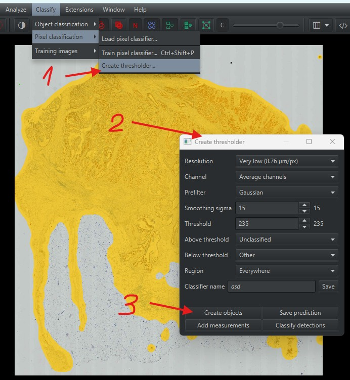
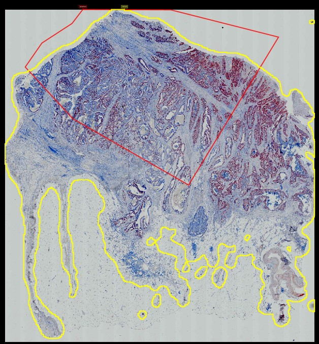
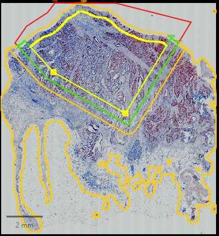

# Seaparate Central, Inner, Outer and Peritumor regions

This algorithm separates the central, inner, outer and peritumor regions of a tumor sample. It is based on *QuPath 0.6*.

The algorithm needs two annotations:
- Precise delineation of the sample (labeled as `sample`)
- Rough delineation of the region of tumor with precise delineation of boundary between tumor and healthy tissue (labeled as `selection`)

1) In the *QuPath* draw the annotation of `sample`. You can use the *Create thresholder* tool in `Classify -> Pixel classification -> Create thresholder`. Rename the annotation to `sample`.
   [
2) Make the `selection` annotation using the *closed polygon annotation* tool.
   [
3) Run the script [`cut_and_make_margin.groovy`](cut_and_make_margin.groovy) in *QuPath*. It will create the `selection` annotation and cut the `sample` annotation to inner, outer and peritumor regions.
   The script can be found [here](cut_and_make_margin.groovy).
   [ 

