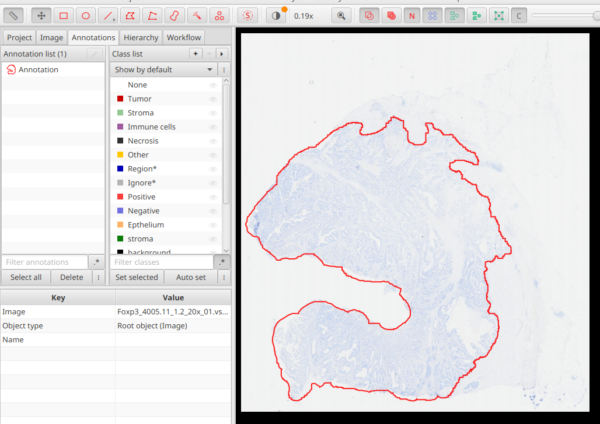
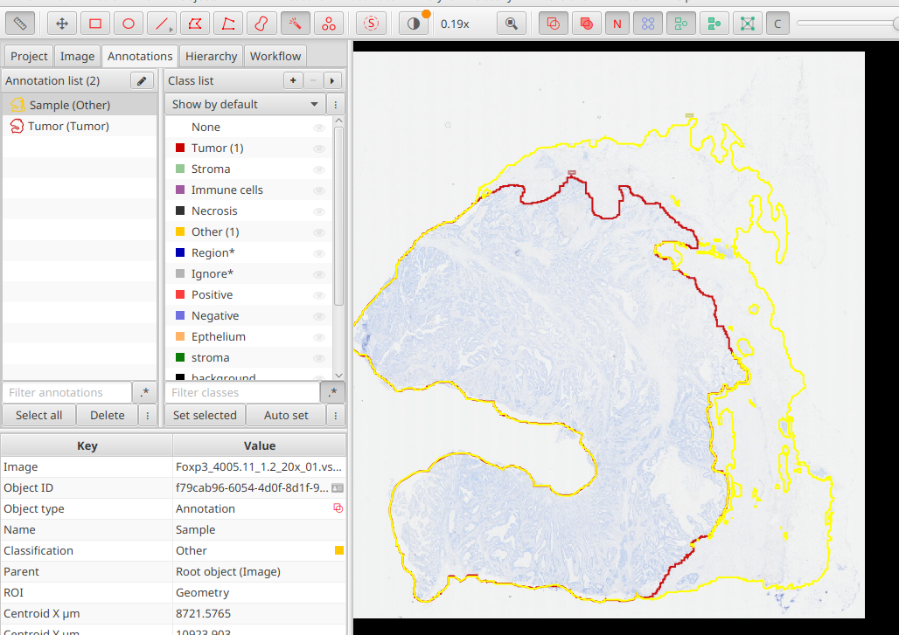
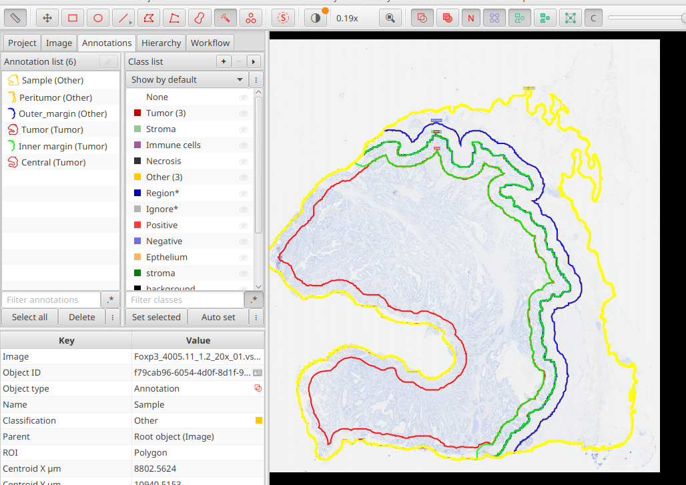

# Seaparate Central, Inner, Outer and Peritumor regions

This algorithm separates the central, inner, outer and peritumor regions of a tumor sample. It is based on *QuPath 0.6*.

The algorithm needs two annotations:
- Precise delineation of the sample (labeled as `sample`)
- Rough delineation of the region of tumor with precise delineation of boundary between tumor and healthy tissue (labeled as `tumor`)

Check the video tutorial:

The workflow is as follows:

1) In the *QuPath* draw the annotation of `tumor`. You can use the *Magic Wand* tool. 

   
2) Run the script [`tumor_peritumor_01_duplicate_and_rename.groovy`](tumor_peritumor_01_duplicate_and_rename.groovy) in *QuPath*. It will duplicate and then rename to `sample` and `tumor`.

3) Finish the `sample` annotation. You can use the *Magic Wand* tool and then correct it by the *Brush* tool. The holes will be filled automatically in the next step.

   

4) Run the script [`tumor_peritumor_02_create`](tumor_peritumor_02_create.groovy) in *QuPath*. 
   It will create the  annotation to inner, outer and peritumor regions.

    

